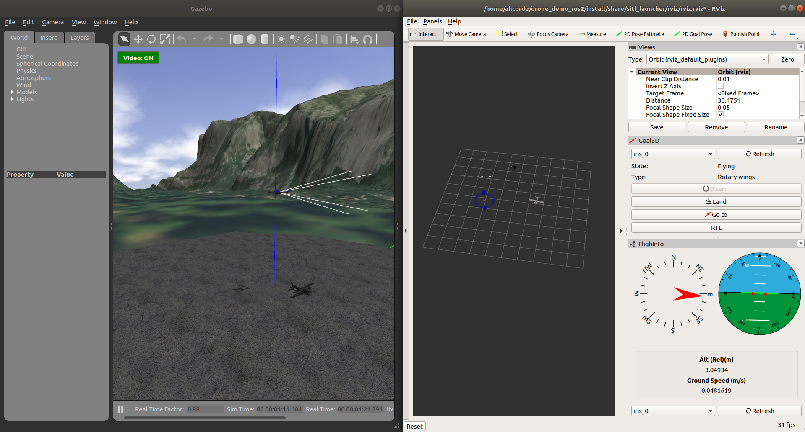
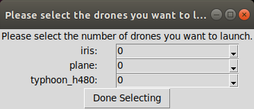
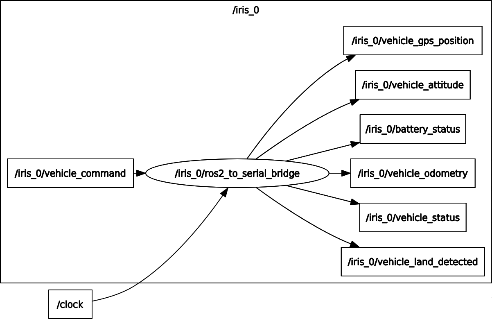
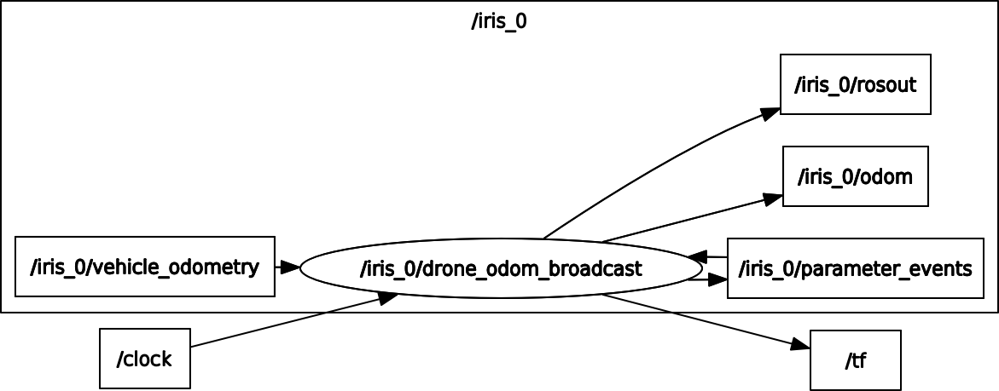
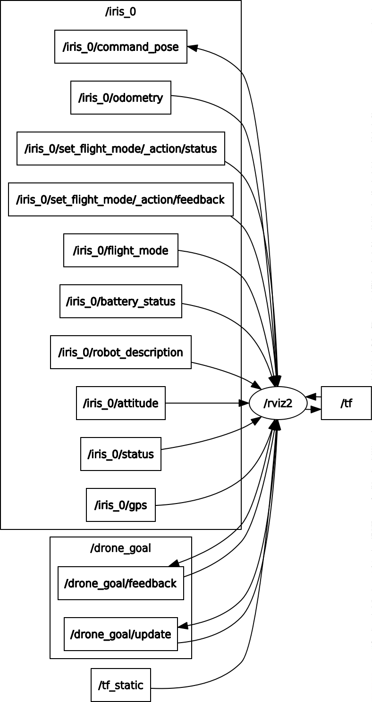
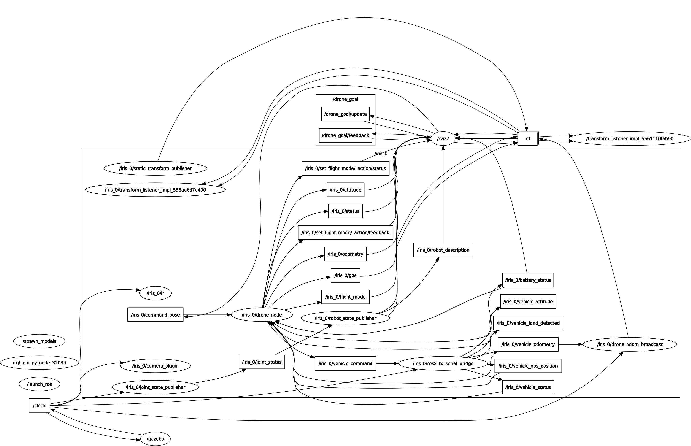
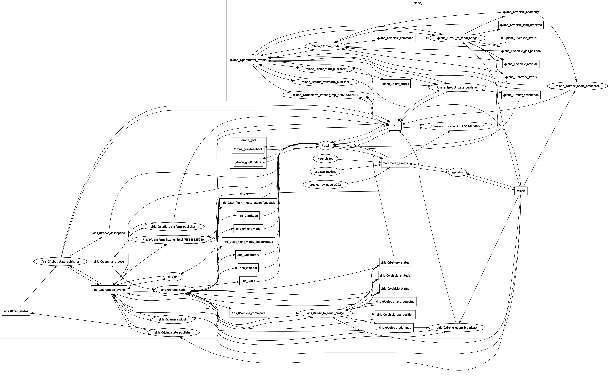

# Drone demo in ROS 2/Gazebo/RVIZ 2

This repository contains the contents for a drone demonstration.

It is running Gazebo, PX4, QGroundControl and some other ROS 2 nodes.

# Video + Pictures

A video and screenshots of the demo can be seen in the [ROS wiki](https://wiki.ros.org/ng_drones):



# Requirements

This demo has been tested on Ubuntu Bionic (18.04)

* An X server
* [Docker](https://www.docker.com/get-docker)
* [nvidia-docker2](https://github.com/nvidia/nvidia-docker/wiki/Installation-(version-2.0))
* The current user is a member of the docker group or other group with docker execution rights.
* [rocker](https://github.com/osrf/rocker)

See the prerequisite instructions [here](https://github.com/osrf/px4sitl/blob/master/install.md):

There are also some notes about how to make it work without an nvidia card as well. Mileage may vary.

# Running

To run the demo from the hosted docker images you can simply invoke

`rocker --x11 --nvidia --user --home --pulse tfoote/drone_demo`

An [RVIZ](http://wiki.ros.org/rviz) window will open showing the drones, sensor output and an [interactive marker](http://wiki.ros.org/interactive_markers) and some buttons to control the drones. A gazebo window will appear showing the simulation.

## Modifying or building your own

See the Dockerfiles and docs in the `docker_deploy` [branch](https://github.com/osrf/drone_demo/tree/docker_deploy):

## What you'll see when you launch

By default it will launch gazebo headless, QGroundControl, and a small python script that will prompt you for how many of what type of drones to launch.

**You can select up to 4 total drones.**

After that gazebo models of the instances will be spawned with appropriately parameterized PX4 autopilots connected.
Once they have initialized you can interact with them via QGroundControl or RVIZ2.


### Changing Behavior

If you'd like to change behavior you can pass argumets with a command like this:

`rocker --x11 --nvidia --user --home --pulse tfoote/drone_demo roslaunch sitl_launcher demo.launch gui:=false sitl_world:=yosemite`

`gui:=true` will enable the Gazebo head

Other valid sitl_worlds are: `mcmillan`, `ksql`, and `baylands`.

You can also pass arguments via `drone_args` to skip the drone selector gui and immediately start the selected drones.

The script is here: https://github.com/osrf/drone_demo/blob/master/sitl_launcher/scripts/launch_drone

## Docs

This drone demonstrator runs Gazebo, PX4, QGroundcontrol and some other ROS 2 components. In this section we will provide some details about the inner ROS 2 architecture.

### Gazebo and PX4

The launchfile [demo.launch.py](https://github.com/osrf/drone_demo/blob/ahcorde/ros2/sitl_launcher/launch/demo.launch.py) creates the Gazebo world and also it launches an GUI to select the drones that you want to include in the world. The GUI has the following aspect:



When you have selected the drones and clicked in the "Done Selecting" button, this node will expand in the world the drones. Each one of the drones will launch a PX4 instance. These instances connect with a bridge called [ros2_to_serial_bridge](https://github.com/osrf/ros2_serial_example/tree/master/ros2_serial_example) with converts the [uORB messages](https://dev.px4.io/v1.9.0/en/middleware/uorb.html) into ROS 2 [px4_msgs](https://github.com/PX4/px4_msgs/) messages.

Inside PX4 code there is a file called [uorb_rtps_message_ids.yaml](https://github.com/PX4/Firmware/blob/master/msg/tools/uorb_rtps_message_ids.yaml) which defines the publishers and subscribers that the bridge will connect. For example, the `battery_status` message will be send by the PX4 uORB publisher and the bridge will republish this message into the ROS 2 network using [px4_msgs/BatteryStatus](https://github.com/PX4/px4_msgs/blob/master/msg/BatteryStatus.msg) message. Something similar happens with subscriber like `vehicle_command` which is defined as `receive`, the bridge will create a subscriber with [px4_msgs/VehicleCommand](https://github.com/PX4/px4_msgs/blob/master/msg/VehicleCommand.msg) message and this will be republish into the PX4 uORB network.

```yaml
- msg: battery_status
  id: 6
  send: true
...
- msg: vehicle_command
  id: 89
  receive: true
```

Gazebo launches some nodes thanks to some of the plugins running for each drone. It creates a camera node and joint state publisher node which will allow us to visualize the model in RVIZ2.

**NOTES**
 - In the official documentation of PX4 you can find [more details](https://dev.px4.io/v1.9.0/en/middleware/micrortps.html#ros2ros-application-pipeline)
 - If you want to understand how the [ros2_to_serial_bridge](https://github.com/osrf/ros2_serial_example/tree/master/ros2_serial_example) works there is an extense [readme](https://github.com/osrf/ros2_serial_example).

## ROS 2

### ros2_to_serial_bridge

Based on the section above we will have a node publishing some topics:

  - `/iris_0/vehicle_gps_position`: GPS position in WGS84 coordinates.
  - `/iris_0/vehicle_attitude`: it contains the rotation from XYZ body frame to NED earth frame.
  - `/iris_0/vehicle_status`: it contains internal information about the drone such us arming state, flight mode, etc
  - `/iris_0/battery_status`: it contains data about the voltage, cells, etc
  - `/iris_0/vehicle_land_detected`: it contains information about the landing state
  - `/iris_0/vehicle_odometry`: Vehicle odometry. It fits ROS REP 147 for aerial vehicles

and one subscription to:

 - `/iris_0/vehicle_command`: it allows us to send commands to the drone

 

### drone_odom_broadcast

This node is subscribed to `vehicle_odometry` topic from  [ros2_to_serial_bridge](https://github.com/osrf/ros2_serial_example/tree/master/ros2_serial_example) node. This node publish the `odom` topic and broadcast the corresponding transforms to [tf](http://wiki.ros.org/tf).



### drone_node

This node converts the [px4_msgs/BatteryStatus](https://github.com/PX4/px4_msgs/blob/master/msg/BatteryStatus.msg) messages generated by the ros2_to_serial_bridge node to [REP 147 messages](https://www.ros.org/reps/rep-0147.html)


#### Publishers:
 - `battery_status` publish [sensor_msgs/BaterryState](https://github.com/ros2/common_interfaces/blob/master/sensor_msgs/msg/BatteryState.msg) message.
 - `flight_mode` publish [proposed_aerial_msgs::msg::FlightMode](https://github.com/osrf/drone_demo/blob/ahcorde/ros2/proposed_aerial_msgs/msg/FlightMode.msg)
 - `vehicle_status` publish [proposed_aerial_msgs::msg::VehicleStatus](https://github.com/osrf/drone_demo/blob/ahcorde/ros2/proposed_aerial_msgs/msg/VehicleStatus.msg)
 - `odometry` publish [nav_msgs::msg::Odometry](https://github.com/ros2/common_interfaces/blob/master/nav_msgs/msg/Odometry.msg)
 - `vehicle_gps_position` publish [sensor_msgs::msg::NavSatFix](https://github.com/ros2/common_interfaces/blob/master/sensor_msgs/msg/NavSatFix.msg)
 - `attitude` publish [proposed_aerial_msgs::msg::Attitude](https://github.com/osrf/drone_demo/blob/ahcorde/ros2/proposed_aerial_msgs/msg/Attitude.msg)


#### Subscribers:

 - `command_pose` is subscribed to [geometry_msgs::msg::PoseStamped](https://github.com/ros2/common_interfaces/blob/master/geometry_msgs/msg/PoseStamped.msg)

#### Actions

 - `set_flight_mode` creates the action [proposed_aerial_msgs::action::SetFlightMode](https://github.com/osrf/drone_demo/blob/ahcorde/ros2/proposed_aerial_msgs/action/SetFlightMode.action)

### RVIZ 2

RVIZ2 is subscribed to topics coming from `drone_node` node and tf. Using the interface you can also send some commands.



There is more documentation about how to use rviz_aerial_plugins [here](https://github.com/osrf/rviz_aerial_plugins)

The hole system graph:



The ROS 2 graph using one Iris and one plane:



The drone demonstrator allows to use multirobot. As you can see each drone in the system has its own [namespace](http://wiki.ros.org/Names).

 - Iris namespace is `iris_0`
 - plane namespace is `plane_1`
